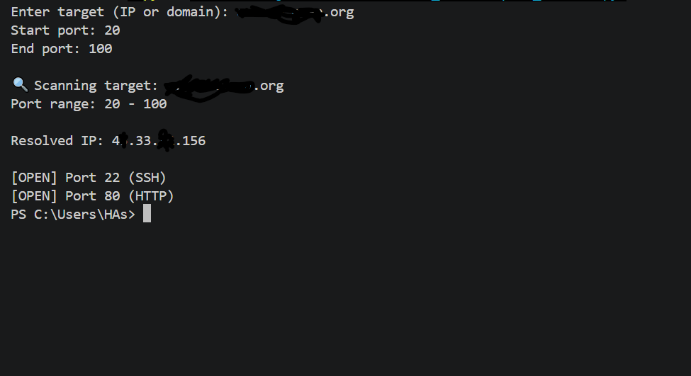

# Advanced Port Scanner (Python)

A multi-threaded TCP port scanner built in Python that identifies open ports, detects running services, and performs basic banner grabbing for network analysis.

---

# Overview

This project demonstrates fundamental networking and cybersecurity concepts by scanning a target system for open ports and identifying associated services. It uses concurrent execution to improve performance and includes techniques commonly used in real-world reconnaissance.

---

# Features

* Multi-threaded port scanning for faster execution
* Custom port range scanning
* Detection of open ports using TCP connections
* Service identification based on common port mappings
* Banner grabbing for basic service and version detection
* Timeout handling for improved reliability

---

# How It Works

1. Target Resolution
   Converts a domain name into an IP address using DNS.

2. Port Scanning
   Attempts TCP connections to each port in the specified range.

3. Open Port Detection
   Identifies open ports based on successful connections.

4. Service Identification
   Maps known ports to common services (e.g., HTTP, SSH).

5. Banner Grabbing
   Retrieves service information from open ports when available.

6. Multi-threading
   Uses concurrent threads to scan multiple ports simultaneously for better performance.

---

# Technologies Used

* Python
* `socket` (network communication)
* `concurrent.futures` (multi-threading)

---

# Installation

Clone the repository:

```bash id="kzz9o3"
git clone https://github.com/HasnainRaza67/Port_scanner.git
cd Port_scanner
```

No external dependencies are required.

---

# Usage

Run the program:

```bash id="4r6qyz"
python port_scanner.py
```

Provide input when prompted:

```text id="r3r5hb"
Enter target (IP or domain): scanme.nmap.org
Start port: 20
End port: 100
```

---

# Example Output

```text id="d3qf9t"
Scanning target: scanme.nmap.org
Port range: 20 - 100

Resolved IP: 45.33.32.156

[OPEN] Port 22 (SSH)
[OPEN] Port 80 (HTTP)
```

---

# Security Considerations

* This tool is intended for educational and authorized testing purposes only
* Only scan systems you own or have explicit permission to test
* Unauthorized scanning may be illegal and unethical

---

# Limitations

* Basic banner grabbing may not always return data
* Service detection is based on common port mappings only
* Does not perform deep vulnerability scanning

---

# Future Improvements

* Asynchronous scanning for higher performance
* OS and service fingerprinting
* Export scan results (CSV/JSON)
* Integration with vulnerability databases
* GUI-based interface

---

# Author

Hasnain Raza
Cyber Security Student

---

# License

This project is open-source and available under the MIT License.

---

# Support

If you found this project useful, consider giving it a star on GitHub.

---

# Output


